# [DRAFT] Serverless Unified Observability Done Right: I wrote a Tutorial so you Don't Have To!

Hi, I am Damian Jankowski currently working as a Site Reliability and Platform Engineering at Kitopi in Cracow, Poland. I hope this tutorial will help you get a better understanding about serverless observability. Let's start with why I tihnk this is important!

# Intro

Observability is a foundational practise that helps answer critical questions about your system's health and performance.
- **Is it available?**
- **Is it responding correctly?**
- **Is it performing fast enough?**
- **Is it cost efficient?**

In a cloud-native world, where serverless architecture are gaining popularity, these questions become even more crucial. Without proper design and observability, the advantages of serverless can quickly become pitfalls, resulting in increased costs, degraded performance, security vulnerabilities, and complex debugging scenarios.

Like many others, I typically rely on cloud-native reference architectures for building my serverless applications. However, when it comes to observability, I've felt that there is not good enough documentation or best practices for instrumenting serverless with OpenTelemetry and connecting those traces to metrics and logs that can be pulled or streamed from the cloud vendor.

In this article, I'll share my **Unified Observability for AWS Serverless Stack GitLab Tutorial**, which showcases all the lessons learned, from setting up the stack (**API Gateway, Lambda, Firehose, etc.**) using **Terraform**, to instrumenting the code with **OpenTelemetry**, and finally to consolidating all observability signals into a single **Dynatrace** platform. 

#TODO 
#add dashboard screenshot

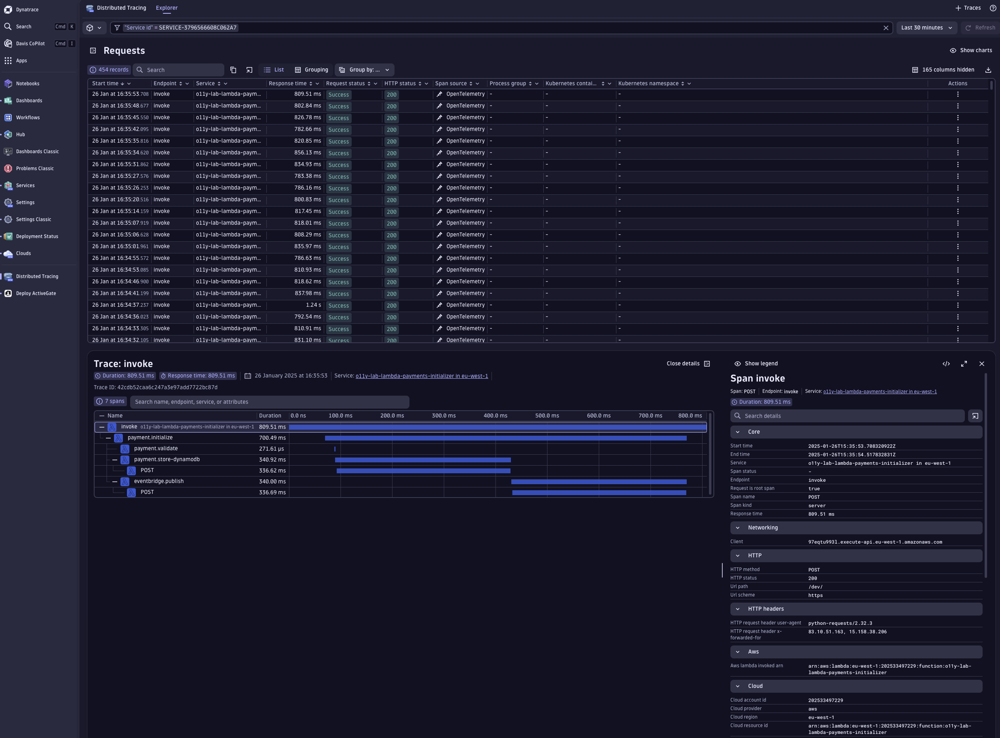

# Observability lab - components
## Architecture

In the article, I propose high-level design:

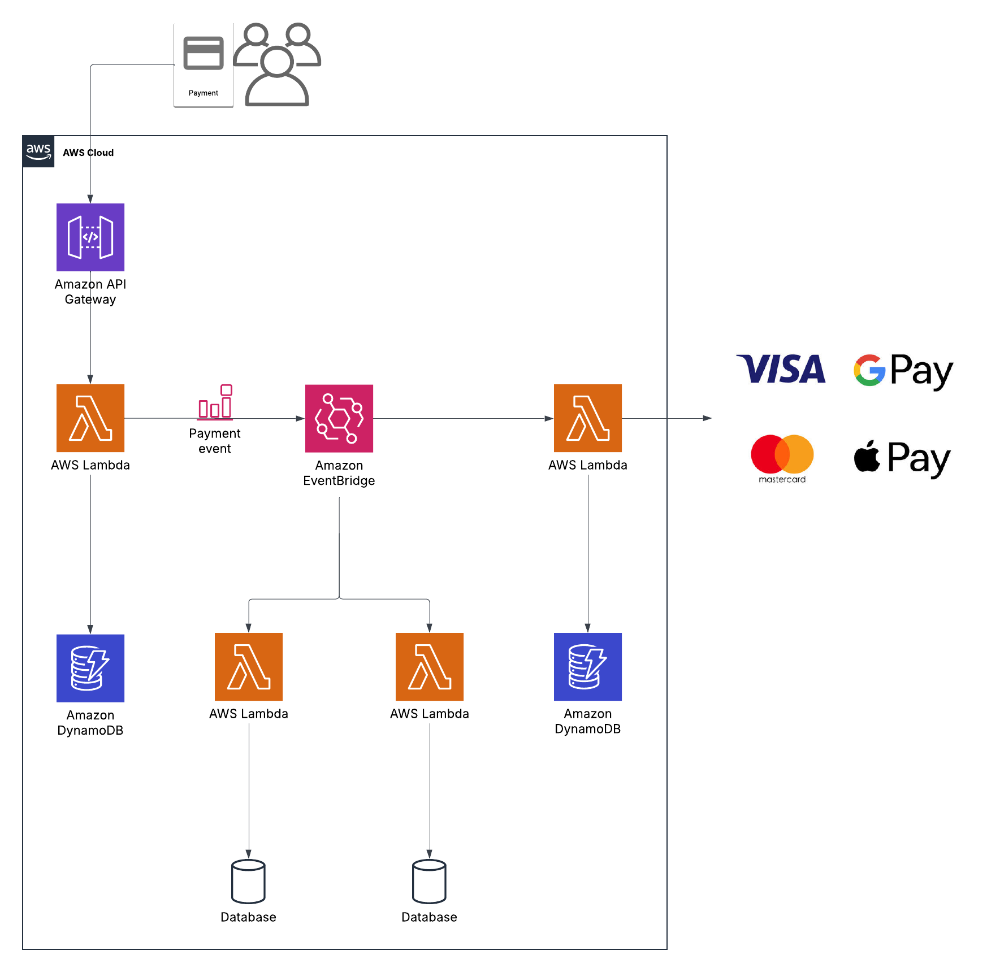

### Simpified pay-in flow steps

1. **Step 1**: Payment request.  
A customer submits a payment request via the API Gateway e.g., clicks `Place Order`.  
**Result**: A payment event is generated with all required data  


2. **Step 2**: Payment initialisation.  
The **Payment Initializer**:  
	- validates the request, 
	- stores payment metadata in DynamoDB (`ShowMeTheMoney` table),  
	-  publishes an `PaymentInitiatedEvent` event to EventBridge including key attributes e.g. `payment_order_id`, `amount`, `currency`  

| **Atribute**       | **Type**   | **Description**                                  |
| ------------------ | ---------- | ------------------------------------------------ |
| `payment_order_id` | `string`   | A global unique for the payment                  |
| `buyer_info`       | `string`   | Information about a buyer                        |
| `payment_details`  | `string`   | Encrypted payment information                    |
| `amount`           | `string`   | Transaction amout                                |
| `currency`         | `string`   | Transaction currency                             |
| `status`           | `string`   | Transaction status (`INITIATED`, `FAILED`, etc.) |
| `timestamp`        | `datetime` | Timestamp of payment inicialization              |
Table 1: Payment metadata - DynamoDB ShowMeTheMoney table

3. **Step 3**: Payment process. 
Once the **`PaymentInitiatedEvent`** is published, EventBridge routes it to multiple subscribers

3.1 **Payment Finalizer**  
- Receives the **`PaymentInitiatedEvent`** from EventBridge.
- Processes the payment with a PSP (Payment Service Provider).
- Updates DynamoDB table (**BreakingTheBank**) with the final status (`SUCCESS` or `FAILED`).
- Publishes a **`PaymentStatusUpdatedEvent`** (containing `payment_order_id`, `payment_status`, and possibly `error_message`) to EventBridge.

| **Atrybut**        | **Typ**    | **Opis**                              |
| ------------------ | ---------- | ------------------------------------- |
| `payment_order_id` | `string`   | A global unique for the payment       |
| `amount`           | `string`   | Transaction amout                     |
| `currency`         | `string`   | Transaction currency                  |
| `payment_status`   | `string`   | Payment status (`SUCCESS`, `FAILED`). |
| `error_message`    | `string`   | Error message                         |
| `timestamp`        | `datetime` | Timestamp of payment registratrion    |
Table 2: Payment status - DynamoDB BrakingTheBank table  

3.2 **Ledger**
- Subscribes to the **`PaymentStatusUpdatedEvent`**.
- Updates the accounting records based on the final status of the payment.
- Ensures full traceability of financial transactions.

3.3 **Wallet**
- Subscribes to the **`PaymentStatusUpdatedEvent`**.
- Updates the merchant’s balance (if the payment is `SUCCESS`).
- Reflects the new wallet state for the merchant.


### **Summary of Event Names**

1. **`PaymentInitiatedEvent`**
    
    - Published by: **Payment Initializer**
    - Consumed by: **Payment Finalizer**
    - Purpose: Informs subscribers that a new payment request is ready to be processed.
2. **`PaymentStatusUpdatedEvent`**
    
    - Published by: **Payment Finalizer**
    - Consumed by: **Ledger**, **Wallet**
    - Purpose: Announces the final status of the payment (e.g., `SUCCESS`, `FAILED`), prompting accounting and wallet updates.

# Overview of the key components

### **1. API Gateway – The Entry Point**

**Role:**

- Handles all HTTP/HTTPS requests coming into the application.
- Integrates with AWS Lambda to build scalable, event-driven workflows.

**Key observability and troubleshooting points:**

- **4xx errors** typically indicate client-side issues (e.g., invalid request parameters or authorization failures).
- **5xx errors** suggest backend or configuration problems, often related to service availability or performance bottlenecks.
- **Latency** measures overall response speed of the API.
- **Integration latency** highlights delays or performance issues specifically at the backend level (e.g., Lambda function execution times).

Together, these metrics and error codes provide a clear starting point for debugging and performance tuning.  

### **2. AWS Lambda – Serverless Compute**

AWS Lambda runs code in response to events without the need to manage servers. It scales automatically based on the number of incoming events such as HTTP requests, changes data in S3 bucket, DynamoDB tables or scheduled tasks.  

**Role:**
- Executes business logic on demand. 

**Key metrics include:**

- **Failure rate** measures failed execution over total invocations
- **Execution duration** shows how long each function run takes, which is critical for optimising performance and costs 
- **Concurrent execution count** - indicates how many Lambda functions are running in parallel 
- **Number of invocations** - reflects overall usage 

These metrics deliver insights into application performance and can guide optimizations.

### **3. Amazon EventBridge – event-driven orchestration**

**Role:**

- Acts as the central hub for event routing and decoupling between microservices.

**Key metrics:**
- **PutEvents p99 latency** measures time it takes to accept and process event
- **Successful invocation attempts** overall number of times EventBridge attempts to invoke the target, including retries

### **4. Amazon DynamoDB – NoSQL database**

**Role:**

- Holds transaction and status details:

**Key DynamoDB metrics:**

- **Read/Write capacity (RCU/WCU):** ensures correct provisioning for throughput.
- **Throttled Requests:** may indicate the need to increase capacity or optimize queries.
- **Latency:** measures read/write performance. 
- **Successfull Read/Write Requests**: reflects how many operations are completed without errors

### 5. Kinesis Data Firehose - streaming data delivery

**Role:**

- Stream into data lakes and warehouses like Amazon S3, Amazon OpenSearch, Dynatrace
- Often used to stream logs, metrics, or transactional data for analytics, auditing, or long-term storage

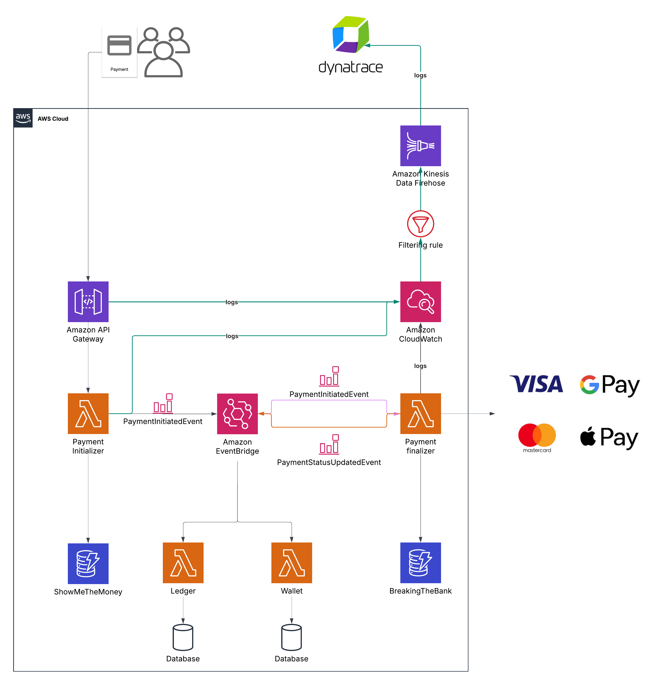

### 6. Amazon CloudWatch 

**Role:**

- Central service for collecting metric, logs, and events across AWS resources

### 7. Instrumentation

What is instrumentation?
**Instrumentation** refers to the process of embedding mechanisms in an application to **collect telemetry data** such as **traces, metrics, and logs**. Modern, distributed applications can be complex to debug, and frameworks like **OpenTelemetry** address this by standardising data collection across various services and languages.

OpenTelemetry gives developers two main ways to instrument the application:
- Code-based solution via APIs and SDKs for languages like `C++, C#/.NET, GO, Java, JavaScript, Python, Ruby, Rust` (all list of supported languages you will find on official website https://opentelemetry.io/docs/languages/)
- Zero-code solutions which are the best way to get started with instrumentation your application or if you are not able to change a code. 

> ✅ **IMPORTANT**:  
 > you can use both solutions simultaneously

## **OpenTelemetry and Dynatrace in AWS Lambda**

To use **OpenTelemetry** in connection to **Dynatrace**, you can leverage **OneAgent**, a dedicated instrumentation agent. Dynatrace provides an AWS Lambda layer that contains OneAgent, making it straightforward to collect telemetry data (logs, metrics, and traces) and send it to Dynatrace.

### How does it works?

- When your Lambda function is called for the first time, the Lambda layer spins up an instance of the OpenTelemetry Collector.  
- The Collector registers itself with the **Lambda Extensions API** and **Telemetry API**, allowing it to receive notifications whenever your function is invoked, when logs are emitted, or when the execution context is about to be shut down.  
- The Collector uses a specialized **decouple processor**, which separates data collection from data export. This means your Lambda function can **return immediately**, without waiting for telemetry to be sent.
- If the Collector has not finished sending all telemetry before the function returns, it will **resume exporting**during the next invocation or just before the Lambda context is fully terminated. This significantly reduces any added latency to your function runtime. It also not increasing a costs. 
    

### Configuration Options

You can configure and deploy this setup using a variety of methods:

- **JSON files**
- **Environment variables**
- **Terraform**
- **AWS SAM**
- **Serverless Framework**
- **AWS CloudFormation**

### Benefits for Serverless Environments

By adopting this architecture:

- You gain **comprehensive telemetry** (logs, metrics, traces) with minimal code changes and operational overhead.
- **Performance insights** and **faster troubleshooting** become possible, thanks to rich observability data.
- Lambda’s execution time and costs are only minimally impacted, due to the asynchronous nature of telemetry export.

In short, **OpenTelemetry** combined with **Dynatrace OneAgent** provides an efficient, non-blocking way to gather and analyze crucial information about your serverless applications in AWS Lambda.

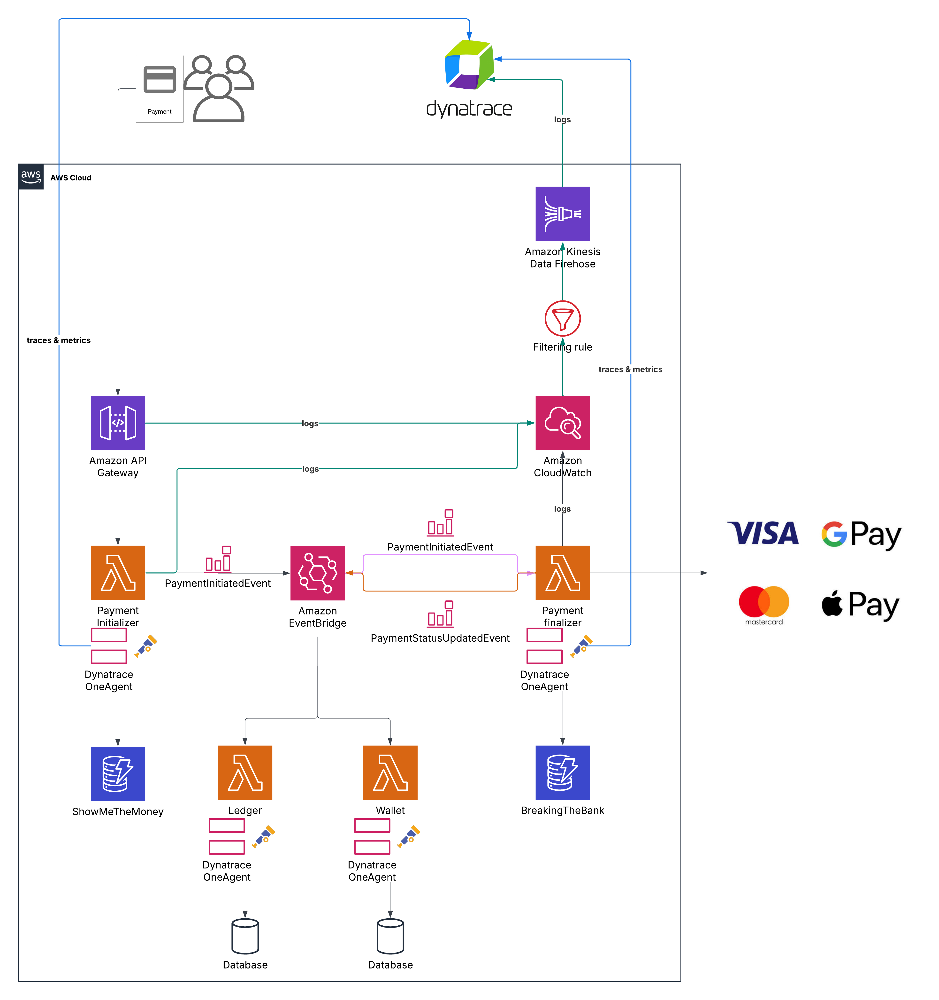

# Let’s kickstart this adventure - setting up the environment

In the following sections, we’ll walk through setting up this environment, configuring key observability metrics, and analyzing the data. By the end, you'll have a practical roadmap for implementing observability in your own infrastructure.

## Prerequisites

Before diving into the creation of an AWS Lambda Function, ensure you have the following:

- [ ] **AWS Account**: If you don’t have one, create it at [AWS Signup](https://signin.aws.amazon.com/signup?request_type=register).
- [ ] **IAM Permissions**: Ensure your AWS user has the necessary permissions to create and manage Lambda functions and API Gateway resources.

## Sign in to AWS Management Console
Access the [AWS Management Console](https://aws.amazon.com/console/) and log in to your account.

## Lambda Function with zip stored on S3 bucket

### Prerequistis:  
S3 bucket created
1. Open AWS Console and navigate to Amazon S3 bucket
2. Click on `create bucket` on the top right window
3. Enter the bucket name
4. Ensure that `block all public access` is ticked
5. Click on create bucket 

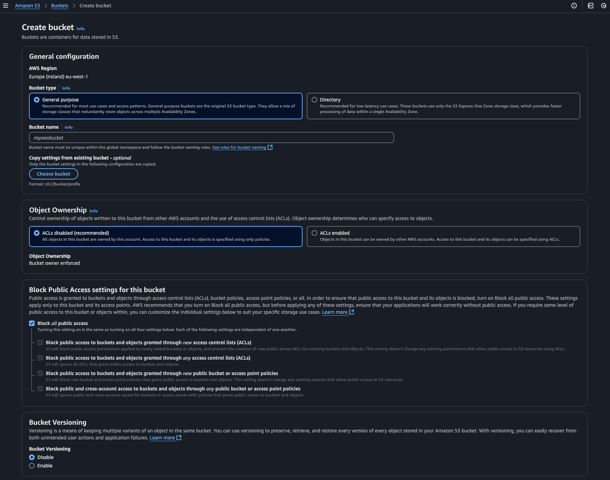

### Lambda Function

##### Step 1: Create source code `lambda.py`

```python
def handler(event, context):
    return {"statusCode": 200, "body": "Show me the money!!"}
```

##### Step 2: Create AWS Lambda

To create a Lambda function with a container image:

1. Open **Lambda** in the AWS Console.
2. Click on **Create Function** in the top-right corner.
3. Choose **Author from scratch** and fill in the following under **Basic Information**:
   - **Function name**: `o11y-lab-lambda-payments-initializer`
   - **Runtime**: `python3.13`
4. Click **Create Function** to complete the setup.

##### Step 3: Install Dependencies (if needed)

If your Lambda function requires additional libraries, install them in the same directory as lambda.py. For example: 

```bash
mkdir -p package_directory
pip install --target package_directory -r requirements.txt
```

##### Step 4: Package the code

Create a ZIP file containing your Lambda function and dependencies. Run the following command in the directory where lambda_function.py is located:
	
```bash
cd package_directory && zip -r ../deployment_package .
zip deployment_package.zip lambda.py
```

##### Step 5: Upload the ZIP to S3 bucket 
- CLI:
```bash
aws s3 cp deployment_package.zip s3://o11y-lab-s3-bucket/deployment_package.zip
```

- you can also upload a file to Amazon S3 using UI:
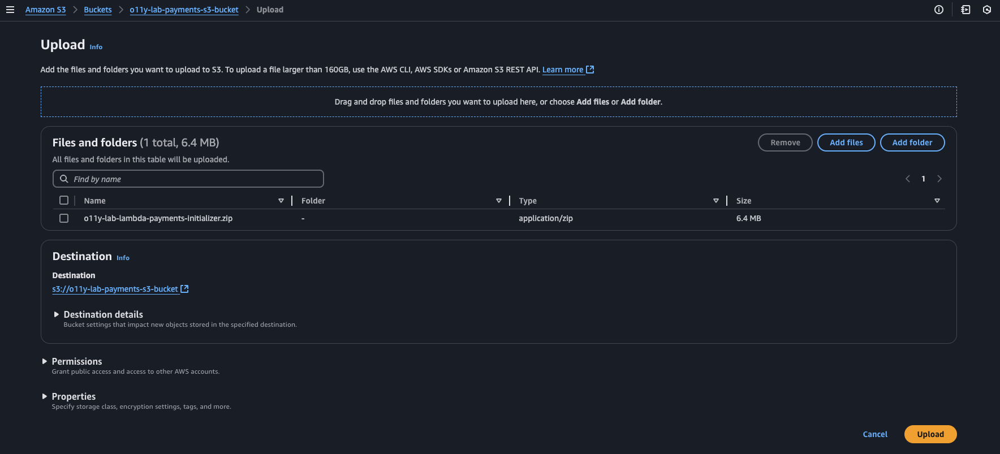

- and then choose a right package in S3 bucket:
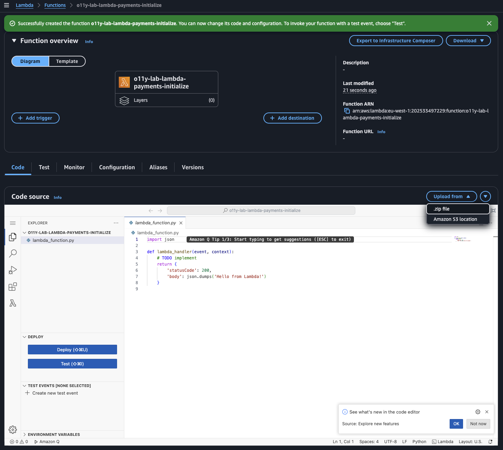
 


### API Gateway

#### Step 1: Navigate to API Gateway

1. Open **API Gateway** in the AWS Console.
2. Click **Create API** and select the **REST API** option.
3. Under **API Details**:
   - Choose **New API**.
   - Set a unique **API Name**, e.g., `o11y-lab-lambda-payments-initializer-api`.


#### Step 2: Create Methods

1. Add a new method:
   - Select **Create Method**.
   - From the dropdown, choose **GET**.
2. Configure the method:
   - **Integration Type**: Select **Lambda Function**.
   - Enable **Lambda Proxy Integration** to send requests to Lambda as structured events.
   - Provide the **Name**, **Alias**, or **ARN** of your Lambda function.
3. Click **Create Method** to save the configuration.
4. Repeat the process for additional methods, such as **POST** and **DELETE**, if needed.


#### Step 3: Deploy the API

1. Click on **Deploy API**.
2. Select or create a deployment stage:
   - If deploying for the first time, create a new stage (e.g., `prod`).
   - Name the stage appropriately.
3. Click **Deploy** to finalize the process.
4. Retrieve the **Invoke URL** for your deployed API from the **Stage Details**.

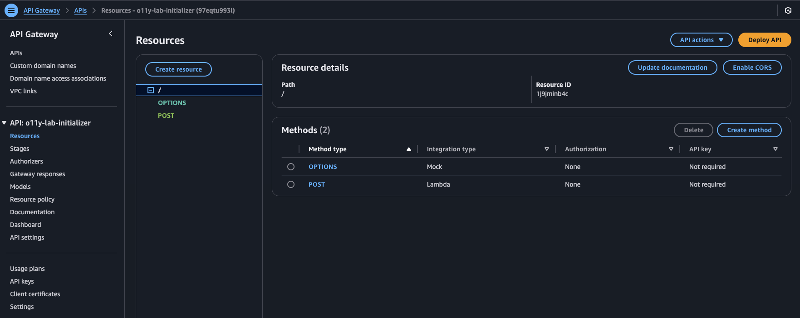

#### Step 4: Enable Logs and Tracing

1. In the **Stage Settings**, click **Edit**.
2. Under **CloudWatch Logs**, enable the following:
   - **Errors and Info Logs**.
   - **Detailed Metrics** for advanced monitoring.

### Checkpoint

To ensure that everythings work correctly, run
```
curl -X GET "https://{APIGATEWAY_UNIQUE_ID}.execute-api.eu-west-1.amazonaws.com/{STAGE}"
```
it should return `Show me the money!!`

you can use also Postman, if you prefer a UI environment to work with https://www.postman.com/


### Ingesting AWS Logs into Dynatrace via Amazon Kinesis Data Firehose

This tutorial covers multiple approaches for delivering logs to Dynatrace, with a focus on OpenTelemetry and Amazon Kinesis Data Firehose. Firehose enables secure, real-time log ingestion from AWS services into Dynatrace. The setup process involves configuring a Firehose delivery stream and establishing a subscription filter to link CloudWatch log groups, ensuring efficient log forwarding.

#### Step 1: Configure an Amazon Kinesis Data Firehose Stream

1. **Access Firehose**: Open the Amazon Kinesis Data Firehose service in the AWS Management Console.
2. **Create a Delivery Stream**: Click on **Create Delivery Stream**.
3. **Set Basic Configuration**:
   - **Source**: Choose **Direct PUT**.
   - **Destination**: Select **Dynatrace**.
   - **Stream Name**: Provide a unique name for the stream, e.g., `DynatraceLogStream`.
   - **Data Transformation**: Ensure this is **disabled**.
4. **Advanced Settings**:
   - **Ingestion Type**: Select **Logs**.
   - **API Token**: Enter your Dynatrace API token (see prerequisites).
   - **API URL**: Specify your Dynatrace environment URL.
   - **Content Encoding**: Choose **GZIP**.
   - **Retry Duration**: Set to **900 seconds**.
   - **Buffer Hints**: Configure buffer size to **1 MiB** and buffer interval to **60 seconds**.
   - **Backup Settings**: Enable **Failed data only** and create a backup S3 bucket.
5. **Finalize Stream Creation**: Review your settings and click **Create Delivery Stream**.

The case is slightly different when using Terraform. Since there is no natively supported destination, you need to choose **http_endpoint** instead. This introduces an additional requirement—you must specify a URL with an API endpoint.

```terraform
resource "aws_kinesis_firehose_delivery_stream" "this" {
  name        = local.firehose_stream_name
  destination = "http_endpoint"

  http_endpoint_configuration {
    url                = var.dynatrace_api_url
    name               = "Dynatrace"
    access_key = var.dynatrace_access_key
    retry_duration     = 900
    buffering_size     = 1
    buffering_interval = 60
    role_arn           = aws_iam_role.firehose_role.arn

    s3_backup_mode = "FailedDataOnly"

    s3_configuration {
      role_arn           = aws_iam_role.firehose_role.arn
      bucket_arn         = var.s3_bucket_arn
      prefix             = "firehose-backup/"
      buffering_size     = 10
      buffering_interval = 400
      compression_format = "GZIP"

      cloudwatch_logging_options {
        enabled         = true
        log_group_name  = local.firehose_log_group_s3_backup
        log_stream_name = "S3BackupLogs"
      }
    }

  cloudwatch_logging_options  {
    enabled         = true
    log_group_name  = local.firehose_log_group_http
    log_stream_name = "HttpEndpointLogs"
  }
  }

  tags = {
    Name        = "o11y-lab-terraform-kinesis-firehose-dynatrace-stream"
  }
}
```

#### Step 2: Setup an IAM Role for CloudWatch

A delivery stream requires an IAM role with a trust relationship to CloudWatch. Follow these steps to create the role:

1. **Create an IAM Policy**:
   - Navigate to **IAM > Policies** in the AWS Console.
   - Select **Create Policy** and switch to the JSON editor. Paste the following policy:
     ```json
     {
       "Version": "2012-10-17",
       "Statement": [
         {
           "Effect": "Allow",
           "Action": [
             "firehose:PutRecord",
             "firehose:PutRecordBatch"
           ],
           "Resource": "*"
         }
       ]
     }
     ```
   - For a more restrictive setup, replace `*` with the specific ARN of your Firehose stream.
   - Name the policy and click **Create Policy**.

2. **Create an IAM Role**:
   - Navigate to **IAM > Roles** and click **Create Role**.
   - Choose **Custom Trust Policy** and paste the following JSON:
     ```json
     {
       "Version": "2012-10-17",
       "Statement": [
         {
           "Effect": "Allow",
           "Principal": {
             "Service": "logs.amazonaws.com"
           },
           "Action": "sts:AssumeRole"
         }
       ]
     }
     ```
   - Attach the policy created earlier.
   - Name the role and click **Create Role**.


#### Step 3: Subscribe CloudWatch Log Groups

1. Navigate to **CloudWatch > Logs > Log Groups**.
2. Select the log group you want to stream.
3. Click **Actions > Subscription Filters > Create Amazon Data Firehose Subscription Filter**.
4. Configure the subscription:
   - **Firehose Delivery Stream**: Select the stream you created earlier.
   - **IAM Role**: Choose the role created in Step 2.
   - **Filter Name**: Provide a descriptive name for the subscription.
5. Click **Start Streaming** to activate log forwarding.

### OpenTelemetry Dynatrace OneAgent Lambda Layer 

#### Step 1: Add layer to Lambda function
1. Open **Lambda** in the AWS Console.
2. Scroll down in `Code` section and
3. Click on `Add a layer`
   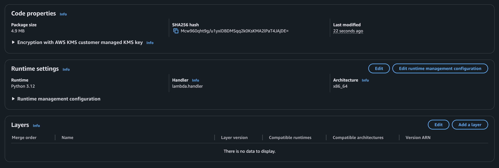
4. Choose `Specify an ARN` and fill it with necessary ARN e.g. `arn:aws:lambda:eu-west-1:725887861453:layer:Dynatrace_OneAgent_1_303_2_20241004-043401_with_collector_python:1`
   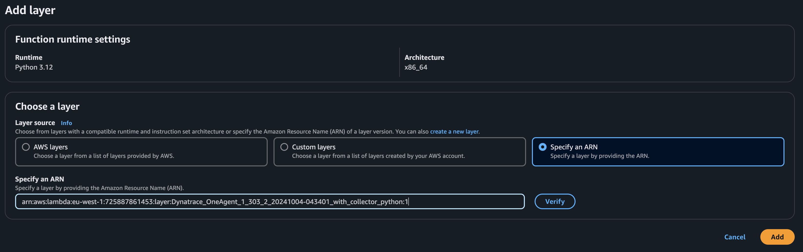
6. Click `Add` to finalize a process

then environments variables needs to be setup. Navigate to `Configuration` section of your Lambda settings and fill all necessary values.
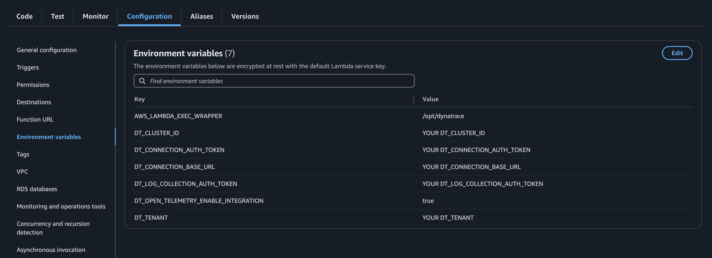

# Terraform

Alternatively, you can use Terraform to automate all the necessary steps described above. Since this is not a Terraform course, I will provide only a brief example to illustrate the process. However, you can find a complete implementation in the repository.

Bellow example show how Dynatrace AWS Layer
` layers = var.lambda_layers_arns` is added to the AWS Lambda. 

## Lambda layer configuration

Lambda definition
```terraform
resource "aws_lambda_function" "function" {  
  function_name = var.function_name  
  
  s3_bucket   = var.s3_bucket  
  s3_key      = var.s3_key  
  publish     = var.publish  
  handler     = var.handler  
  runtime     = "python3.12"  
  memory_size = 192  
  timeout     = 30  
  
  role = aws_iam_role.iam_for_lambda.arn  
  
  layers = var.lambda_layers_arns  
  
  environment {  
    variables = var.environment_variables  
  }  
}
```

Variables for Dynatrace configuration
```
variable "environment_variables" {  
  description = "A map of environment variables to be set for the Lambda function."  
  type        = map(string)  
  sensitive   = true  
  default     = {}  
}
```

Example of Dynatrace environments variable
```
environment_variables_dynatrace_open_telemetry = {  
  AWS_LAMBDA_EXEC_WRAPPER              = "/opt/dynatrace"  
  DT_TENANT                            = "<YOUR DT_TENANT>"  
  DT_CLUSTER_ID                        = "<YOUR DT_CLUSTER_ID>"
  DT_CONNECTION_BASE_URL               = "https://<DT_TENANT>.live.dynatrace.com"  
  DT_CONNECTION_AUTH_TOKEN             = "<YOUR DT_CONNECTION_AUTH_TOKEN>"   
  DT_LOG_COLLECTION_AUTH_TOKEN         = "<YOUR DT_LOG_COLLECTION_AUTH_TOKEN>"  
  DT_OPEN_TELEMETRY_ENABLE_INTEGRATION = "true"  
}  
lambda_layers_arns = [  
  "arn:aws:lambda:<YOUR REGION>:725887861453:layer:Dynatrace_OneAgent_1_303_2_20241004-043401_with_collector_python:1"  
]
```


# How to retrive all necessary values?
Dynatrace offers quite good support for onboarding users. To retrive all necessary configuration you have to:
1. Log into your Dynatrace account
2. Open `Distributed Tracing` application
3. Select source: `Cloud Workload` then `AWS` and `Lambda`
Configuration wizzard opens possibility to retrive all necessery values to go throught above example. Event Terraform snipped is added.

# Cream de la creme... Confirmation! 
Speaking of confirmation, finally we are reaching the point when Dynatrace is going to be used. Lambda should be visible in new `Services` application. 
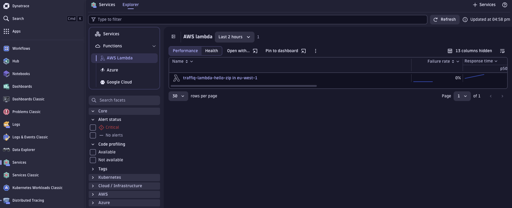
From that point you can easly navigate to `Distributed tracing` application
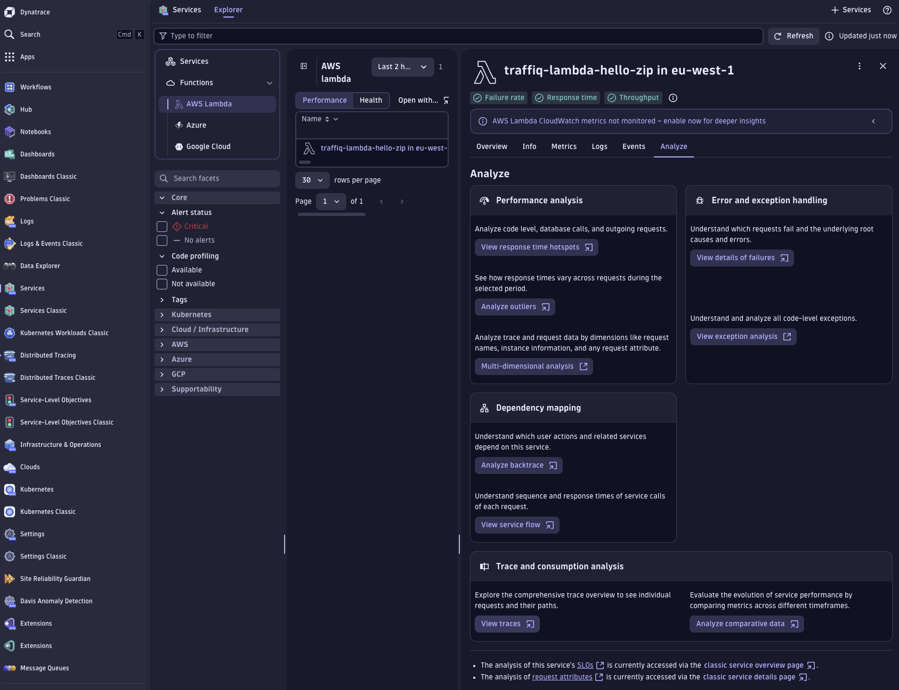

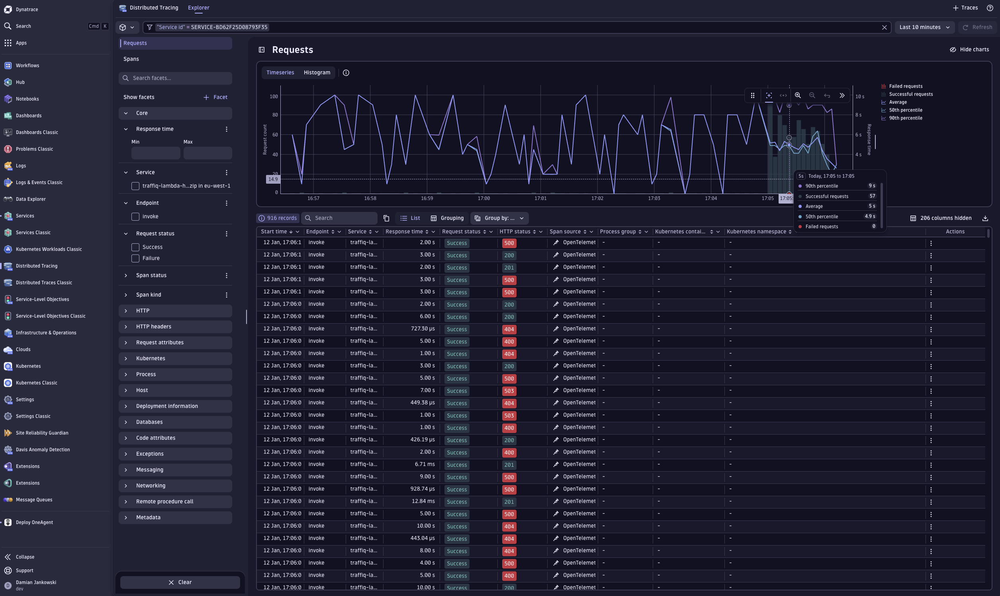

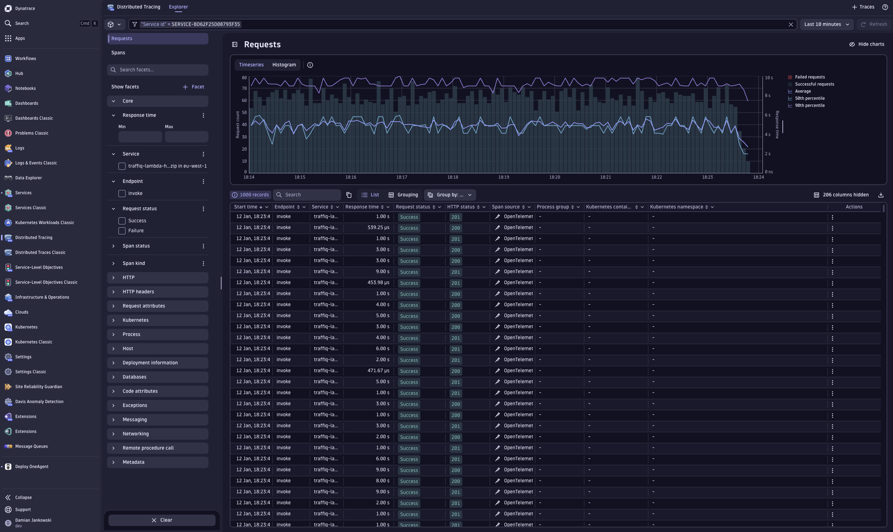

# What 


=====
to be used:

# Tools
## OpenTelemetry 
open-source tool for collecting, and processing data such as traces, metrics and logs. Serverless requests flow throught multiple serveices. The key benefit of OpenTelemetry is insight into such flow. More info you will find below.

## Dynatrace 
For enterprise-grade observability, we integrate the setup with Dynatrace, a comprehensive monitoring platform. Dynatrace provides powerful AI-driven insights, anomaly detection, and dashboards tailored for API performance. It complements OpenTelemetry by adding deep analytics and actionable intelligence to the collected data.

# Summary
By leveraging observability, teams gain actionable insights into patterns, error rates, traffic flows, and backend integration performance. This data-driven approach not only helps in identifying and resolving issues proactively but also empowers engineering teams to optimize  performance and deliver exceptional end-user experiences.


Elastic Container Registry (ECR)

To use a Docker image-based Lambda function, we first need to create an **Elastic Container Registry (ECR)** to store the Docker image containing the Lambda code.

1. Open **ECR** in the AWS Console.
2. Click **Create registry** in the top-right corner.
3. Under General settings:
   - Set a unique name for the registry, e.g., `o11y-lab`.
4. Click **Create** to finalize the setup.


### Lambda Function with Docker

Let’s create a simple Python-based Lambda function that returns `"Show me the money!!"`.

##### Step 1: Create `lambda.py`

```python
def handler(event, context):
    return {"statusCode": 200, "body": "Show me the money!!"}
```

##### Step 2: Create a `Dockerfile`

```dockerfile
FROM public.ecr.aws/lambda/python:3.12-x86_64

COPY lambda.py ${LAMBDA_TASK_ROOT}

CMD ["lambda_function.handler"]
```

##### Step 3: Build and Push the Docker Image

- **Authenticate Docker Client to ECR**

Retrieve an authentication token and authenticate your Docker client to the registry using the AWS CLI:

```bash
aws ecr get-login-password --region $(AWS_REGION) | docker login --username AWS --password-stdin $(AWS_ACCOUNT_ID).dkr.ecr.$(AWS_REGION).amazonaws.com
```

- **Build the Docker Image**

Build the Docker image for the `linux/amd64` platform:

```bash
docker build --platform linux/amd64 -t o11y-lab-lambda-payments-initializer:latest .
```

- **Tag the Docker Image**

After the build is complete, tag the image for your ECR repository:

```bash
docker tag o11y-lab-lambda-payments-initializer:latest $(AWS_ACCOUNT_ID).dkr.ecr.eu-west-1.amazonaws.com/o11y-lab-lambda-payments-initializer:latest
```

- **Push the Image to ECR**

Push the image to your newly created ECR repository:

```bash
docker push $(AWS_ACCOUNT_ID).dkr.ecr.eu-west-1.amazonaws.com/o11y-lab-lambda-payments-initializer:latest
```