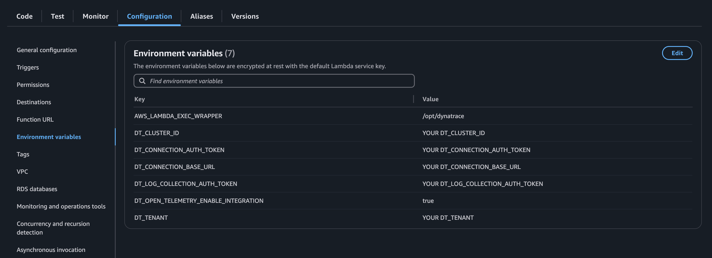

# Serverless Unified Observability Done Right: I wrote a Tutorial so you Don't Have To!

Hi, I am Damian Jankowski currently working as a Site Reliability Engineer at InPost in Cracow, Poland. I hope this tutorial will help you get a better understanding about serverless observability. Let's start with why I think this is important!

## Intro

Observability is a foundational practice that helps answer critical questions about your system's health and performance.

- **Is it available?**
- **Is it responding correctly?**
- **Is it performing fast enough?**
- **Is it cost efficient?**

In a cloud-native world, where serverless architectures are gaining popularity, these questions become even more crucial. Without proper design and observability, the advantages of serverless can quickly become pitfalls, resulting in increased costs, degraded performance, security vulnerabilities, and complex debugging scenarios.

Like many others, I typically rely on cloud-native reference architectures for building my serverless applications. However, when it comes to observability, I've felt that there is not enough good documentation or best practices for instrumenting serverless with OpenTelemetry and connecting those traces to metrics and logs that can be pulled or streamed from the cloud vendor.

In this article, I'll share my **Unified Observability for AWS Serverless Stack GitLab Tutorial**, which showcases all the lessons learned, from setting up the stack (`API Gateway`, `Lambda`, `Firehose`, etc.) using `Terraform`, to instrumenting the code with `OpenTelemetry`, and finally to consolidating all observability signals into a single `Dynatrace` platform.


## Observability lab - components

### Architecture

In the article, I propose high-level design:


#### Simplified pay-in flow steps

1.  **Step 1**: Payment request.
    A customer submits a payment request via the API Gateway e.g., clicks `Place Order`.
    **Result**: A payment event is generated with all required data

2.  **Step 2**: Payment initialisation.
    The `Payment Initializer`:
    - validates the request,
    - stores payment metadata in DynamoDB (`ShowMeTheMoney` table),
    - publishes an `PaymentInitiatedEvent` event to EventBridge including key attributes e.g. `payment_order_id`, `amount`, `currency`

| **Atribute**       | **Type**   | **Description**                                  |
| ------------------ | ---------- | ------------------------------------------------ |
| `payment_order_id` | `string`   | A global unique for the payment                  |
| `buyer_info`       | `string`   | Information about a buyer                        |
| `payment_details`  | `string`   | Encrypted payment information                    |
| `amount`           | `string`   | Transaction amount                               |
| `currency`         | `string`   | Transaction currency                             |
| `status`           | `string`   | Transaction status (`INITIATED`, `FAILED`, etc.) |
| `timestamp`        | `datetime` | Timestamp of payment initialization              |
Table 1: Payment metadata - DynamoDB ShowMeTheMoney table

3.  **Step 3**: Payment process.
    Once the `PaymentInitiatedEvent` is published, EventBridge routes it to multiple subscribers

**3.1 Payment Finalizer**
- Receives the `PaymentInitiatedEvent` from EventBridge.
- Processes the payment with a PSP (Payment Service Provider).
- Updates DynamoDB table (`BreakingTheBank`) with the final status (`SUCCESS` or `FAILED`).
- Publishes a `PaymentStatusUpdatedEvent` (containing `payment_order_id`, `payment_status`, and possibly `error_message`) to EventBridge.

| **Atrybut**        | **Typ**    | **Opis**                              |
| ------------------ | ---------- | ------------------------------------- |
| `payment_order_id` | `string`   | A global unique for the payment       |
| `amount`           | `string`   | Transaction amount                    |
| `currency`         | `string`   | Transaction currency                  |
| `payment_status`   | `string`   | Payment status (`SUCCESS`, `FAILED`). |
| `error_message`    | `string`   | Error message                         |
| `timestamp`        | `datetime` | Timestamp of payment registration     |
Table 2: Payment status - DynamoDB BrakingTheBank table

**3.2 Ledger**
- Subscribes to the `PaymentStatusUpdatedEvent`.
- Updates the accounting records based on the final status of the payment.
- Ensures full traceability of financial transactions.

**3.3 Wallet**
- Subscribes to the `PaymentStatusUpdatedEvent`.
- Updates the merchant's balance (if the payment is `SUCCESS`).
- Reflects the new wallet state for the merchant.

#### Summary of Event Names

1.  `PaymentInitiatedEvent`

    - Published by: `Payment Initializer`
    - Consumed by: `Payment Finalizer`
    - Purpose: Informs subscribers that a new payment request is ready to be processed.

2.  `PaymentStatusUpdatedEvent`

    - Published by: `Payment Finalizer`
    - Consumed by: `Ledger`, `Wallet`
    - Purpose: Announces the final status of the payment (e.g., `SUCCESS`, `FAILED`), prompting accounting and wallet updates.

## Overview of the key components

### 1. API Gateway – The Entry Point

**Role:**

- Handles all HTTP/HTTPS requests coming into the application.
- Integrates with AWS Lambda to build scalable, event-driven workflows.

**Key observability and troubleshooting points:**

- `4xx errors` typically indicate client-side issues (e.g., invalid request parameters or authorization failures).
- `5xx errors` suggest backend or configuration problems, often related to service availability or performance bottlenecks.
- `Latency` measures overall response speed of the API.
- `Integration latency` highlights delays or performance issues specifically at the backend level (e.g., Lambda function execution times).

Together, these metrics and error codes provide a clear starting point for debugging and performance tuning.

### 2. AWS Lambda – Serverless Compute

AWS Lambda runs code in response to events without the need to manage servers. It scales automatically based on the number of incoming events such as HTTP requests, changes data in S3 bucket, DynamoDB tables or scheduled tasks.

**Role:**
- Executes business logic on demand.

**Key metrics include:**

- `Failure rate` measures failed execution over total invocations
- `Execution duration` shows how long each function run takes, which is critical for optimizing performance and costs
- `Concurrent execution count` - indicates how many Lambda functions are running in parallel
- `Number of invocations` - reflects overall usage

These metrics deliver insights into application performance and can guide optimizations.

### 3. Amazon EventBridge – event-driven orchestration

**Role:**

- Acts as the central hub for event routing and decoupling between microservices.

**Key metrics:**
- `PutEvents p99 latency` measures time it takes to accept and process event
- `Successful invocation attempts` overall number of times EventBridge attempts to invoke the target, including retries

### 4. Amazon DynamoDB – NoSQL database

**Role:**

- Holds transaction and status details:

**Key DynamoDB metrics:**

- `Read/Write capacity (RCU/WCU)`: ensures correct provisioning for throughput.
- `Throttled Requests`: may indicate the need to increase capacity or optimize queries.
- `Latency`: measures read/write performance.
- `Successful Read/Write Requests`: reflects how many operations are completed without errors

### 5. Kinesis Data Firehose - streaming data delivery

**Role:**

- Stream into data lakes and warehouses like Amazon S3, Amazon OpenSearch, Dynatrace
- Often used to stream logs, metrics, or transactional data for analytics, auditing, or long-term storage


### 6. Amazon CloudWatch

**Role:**

- Central service for collecting metric, logs, and events across AWS resources

### 7. Instrumentation

What is instrumentation?
`Instrumentation` refers to the process of embedding mechanisms in an application to `collect telemetry data` such as `traces`, `metrics`, and `logs`. Modern, distributed applications can be complex to debug, and frameworks like `OpenTelemetry` address this by standardising data collection across various services and languages.

OpenTelemetry gives developers two main ways to instrument the application:
- Code-based solution via APIs and SDKs for languages like `C++`, `C#/.NET`, `GO`, `Java`, `JavaScript`, `Python`, `Ruby`, `Rust` (all list of supported languages you will find on official website https://opentelemetry.io/docs/languages/)
- Zero-code solutions which are the best way to get started with instrumentation your application or if you are not able to change a code.

> ✅ **IMPORTANT**:
> you can use both solutions simultaneously

#### OpenTelemetry and Dynatrace in AWS Lambda

To use `OpenTelemetry` in connection to `Dynatrace`, you can leverage `OneAgent`, a dedicated instrumentation agent. Dynatrace provides an AWS Lambda layer that contains OneAgent, making it straightforward to collect telemetry data (logs, metrics, and traces) and send it to Dynatrace.

##### How does it work?

- When your Lambda function is called for the first time, the Lambda layer spins up an instance of the OpenTelemetry Collector.
- The Collector registers itself with the `Lambda Extensions API` and `Telemetry API`, allowing it to receive notifications whenever your function is invoked, when logs are emitted, or when the execution context is about to be shut down.
- The Collector uses a specialized `decouple processor`, which separates data collection from data export. This means your Lambda function can `return immediately`, without waiting for telemetry to be sent.
- If the Collector has not finished sending all telemetry before the function returns, it will `resume exporting` during the next invocation or just before the Lambda context is fully terminated. This significantly reduces any added latency to your function runtime. It also does not increase costs.

##### Configuration Options

You can configure and deploy this setup using a variety of methods:

- `JSON files`
- `Environment variables`
- `Terraform`
- `AWS SAM`
- `Serverless Framework`
- `AWS CloudFormation`

##### Benefits for Serverless Environments

By adopting this architecture:

- You gain `comprehensive telemetry` (logs, metrics, traces) with minimal code changes and operational overhead.
- `Performance insights` and `faster troubleshooting` become possible, thanks to rich observability data.
- Lambda's execution time and costs are only minimally impacted, due to the asynchronous nature of telemetry export.

In short, `OpenTelemetry` combined with `Dynatrace OneAgent` provides an efficient, non-blocking way to gather and analyze crucial information about your serverless applications in AWS Lambda.


## Let's kickstart this adventure - setting up the environment

In the following sections, we'll walk through setting up this environment, configuring key observability metrics, and analyzing the data. By the end, you'll have a practical roadmap for implementing observability in your own infrastructure.

### Prerequisites

Before diving into the creation of an AWS Lambda Function, ensure you have the following:

- [ ] **AWS Account**: If you don't have one, create it at [AWS Signup](https://signin.aws.amazon.com/signup?request_type=register).
- [ ] **IAM Permissions**: Ensure your AWS user has the necessary permissions to create and manage Lambda functions and API Gateway resources.

### Sign in to AWS Management Console

Access the [AWS Management Console](https://aws.amazon.com/console/) and log in to your account.

### Lambda Function with zip stored on S3 bucket

#### Prerequisites

S3 bucket created

1.  Open AWS Console and navigate to Amazon S3 bucket
2.  Click on `create bucket` on the top right window
3.  Enter the bucket name
4.  Ensure that `block all public access` is ticked
5.  Click on create bucket


#### Lambda Function

**Step 1: Create source code `lambda.py`**

```python
def handler(event, context):
    return {"statusCode": 200, "body": "Show me the money!!"}
```

**Step 2: Create AWS Lambda**

To create a Lambda function with a container image:

1.  Open **Lambda** in the AWS Console.
2.  Click on **Create Function** in the top-right corner.
3.  Choose **Author from scratch** and fill in the following under **Basic Information**:
    - **Function name**: `o11y-lab-lambda-payments-initializer`
    - **Runtime**: `python3.13`
4.  Click **Create Function** to complete the setup.

**Step 3: Install Dependencies (if needed)**

If your Lambda function requires additional libraries, install them in the same directory as `lambda.py`. For example:

```bash
mkdir -p package_directory
pip install --target package_directory -r requirements.txt
```

**Step 4: Package the code**

Create a ZIP file containing your Lambda function and dependencies. Run the following command in the directory where lambda_function.py is located:

```bash
cd package_directory && zip -r ../deployment_package .
zip deployment_package.zip lambda.py
```

**Step 5: Upload the ZIP to S3 bucket**

- CLI:
```bash
aws s3 cp deployment_package.zip s3://o11y-lab-s3-bucket/deployment_package.zip
```

- you can also upload a file to Amazon S3 using UI:

- and then choose a right package in S3 bucket:


### API Gateway

**Step 1: Navigate to API Gateway**

1.  Open **API Gateway** in the AWS Console.
2.  Click **Create API** and select the **REST API** option.
3.  Under **API Details**:
    - Choose **New API**.
    - Set a unique **API Name**, e.g., `o11y-lab-lambda-payments-initializer-api`.

**Step 2: Create Methods**

1.  Add a new method:
    - Select **Create Method**.
    - From the dropdown, choose **GET**.
2.  Configure the method:
    - **Integration Type**: Select **Lambda Function**.
    - Enable **Lambda Proxy Integration** to send requests to Lambda as structured events.
    - Provide the **Name**, **Alias**, or **ARN** of your Lambda function.
3.  Click **Create Method** to save the configuration.
4.  Repeat the process for additional methods, such as **POST** and **DELETE**, if needed.

**Step 3: Deploy the API**

1.  Click on **Deploy API**.
2.  Select or create a deployment stage:
    - If deploying for the first time, create a new stage (e.g., `prod`).
    - Name the stage appropriately.
3.  Click **Deploy** to finalize the process.
4.  Retrieve the **Invoke URL** for your deployed API from the **Stage Details**.


**Step 4: Enable Logs and Tracing**

1.  In the **Stage Settings**, click **Edit**.
2.  Under **CloudWatch Logs**, enable the following:
    - **Errors and Info Logs**.
    - **Detailed Metrics** for advanced monitoring.

### Checkpoint

To ensure that everything works correctly, run:
```bash
curl -X GET "https://{APIGATEWAY_UNIQUE_ID}.execute-api.eu-west-1.amazonaws.com/{STAGE}"
```
it should return `Show me the money!!`

you can use also Postman, if you prefer a UI environment to work with https://www.postman.com/

### Ingesting AWS Logs into Dynatrace via Amazon Kinesis Data Firehose

This tutorial covers multiple approaches for delivering logs to Dynatrace, with a focus on OpenTelemetry and Amazon Kinesis Data Firehose. Firehose enables secure, real-time log ingestion from AWS services into Dynatrace. The setup process involves configuring a Firehose delivery stream and establishing a subscription filter to link CloudWatch log groups, ensuring efficient log forwarding.

**Step 1: Configure an Amazon Kinesis Data Firehose Stream**

1.  **Access Firehose**: Open the Amazon Kinesis Data Firehose service in the AWS Management Console.
2.  **Create a Delivery Stream**: Click on **Create Delivery Stream**.
3.  **Set Basic Configuration**:
    - **Source**: Choose **Direct PUT**.
    - **Destination**: Select **Dynatrace**.
    - **Stream Name**: Provide a unique name for the stream, e.g., `DynatraceLogStream`.
    - **Data Transformation**: Ensure this is **disabled**.
4.  **Advanced Settings**:
    - **Ingestion Type**: Select **Logs**.
    - **API Token**: Enter your Dynatrace API token (see prerequisites).
    - **API URL**: Specify your Dynatrace environment URL.
    - **Content Encoding**: Choose **GZIP**.
    - **Retry Duration**: Set to **900 seconds**.
    - **Buffer Hints**: Configure buffer size to **1 MiB** and buffer interval to **60 seconds**.
    - **Backup Settings**: Enable **Failed data only** and create a backup S3 bucket.
5.  **Finalize Stream Creation**: Review your settings and click **Create Delivery Stream**.

The case is slightly different when using Terraform. Since there is no natively supported destination, you need to choose **http_endpoint** instead. This introduces an additional requirement—you must specify a URL with an API endpoint.

```terraform
resource "aws_kinesis_firehose_delivery_stream" "this" {
  name        = local.firehose_stream_name
  destination = "http_endpoint"

  http_endpoint_configuration {
    url                = var.dynatrace_api_url
    name               = "Dynatrace"
    access_key = var.dynatrace_access_key
    retry_duration     = 900
    buffering_size     = 1
    buffering_interval = 60
    role_arn           = aws_iam_role.firehose_role.arn

    s3_backup_mode = "FailedDataOnly"

    s3_configuration {
      role_arn           = aws_iam_role.firehose_role.arn
      bucket_arn         = var.s3_bucket_arn
      prefix             = "firehose-backup/"
      buffering_size     = 10
      buffering_interval = 400
      compression_format = "GZIP"

      cloudwatch_logging_options {
        enabled         = true
        log_group_name  = local.firehose_log_group_s3_backup
        log_stream_name = "S3BackupLogs"
      }
    }

  cloudwatch_logging_options  {
    enabled         = true
    log_group_name  = local.firehose_log_group_http
    log_stream_name = "HttpEndpointLogs"
  }
  }

  tags = {
    Name        = "o11y-lab-terraform-kinesis-firehose-dynatrace-stream"
  }
}
```

**Step 2: Setup an IAM Role for CloudWatch**

A delivery stream requires an IAM role with a trust relationship to CloudWatch. Follow these steps to create the role:

1.  **Create an IAM Policy**:
    - Navigate to **IAM > Policies** in the AWS Console.
    - Select **Create Policy** and switch to the JSON editor. Paste the following policy:
      ```json
      {
        "Version": "2012-10-17",
        "Statement": [
          {
            "Effect": "Allow",
            "Action": [
              "firehose:PutRecord",
              "firehose:PutRecordBatch"
            ],
            "Resource": "*"
          }
        ]
      }
      ```
    - For a more restrictive setup, replace `*` with the specific ARN of your Firehose stream.
    - Name the policy and click **Create Policy**.

2.  **Create an IAM Role**:
    - Navigate to **IAM > Roles** and click **Create Role**.
    - Choose **Custom Trust Policy** and paste the following JSON:
      ```json
      {
        "Version": "2012-10-17",
        "Statement": [
          {
            "Effect": "Allow",
            "Principal": {
              "Service": "logs.amazonaws.com"
            },
            "Action": "sts:AssumeRole"
          }
        ]
      }
      ```
    - Attach the policy created earlier.
    - Name the role and click **Create Role**.

**Step 3: Subscribe CloudWatch Log Groups**

1.  Navigate to **CloudWatch > Logs > Log Groups**.
2.  Select the log group you want to stream.
3.  Click **Actions > Subscription Filters > Create Amazon Data Firehose Subscription Filter**.
4.  Configure the subscription:
    - **Firehose Delivery Stream**: Select the stream you created earlier.
    - **IAM Role**: Choose the role created in Step 2.
    - **Filter Name**: Provide a descriptive name for the subscription.
5.  Click **Start Streaming** to activate log forwarding.

### OpenTelemetry Dynatrace OneAgent Lambda Layer

**Step 1: Add layer to Lambda function**

1.  Open **Lambda** in the AWS Console.
2.  Scroll down in `Code` section and
3.  Click on `Add a layer`
    
4.  Choose `Specify an ARN` and fill it with necessary ARN e.g. `arn:aws:lambda:eu-west-1:725887861453:layer:Dynatrace_OneAgent_1_303_2_20241004-043401_with_collector_python:1`
    
5.  Click `Add` to finalize a process

then environments variables needs to be setup. Navigate to `Configuration` section of your Lambda settings and fill all necessary values.

## Terraform

Alternatively, you can use Terraform to automate all the necessary steps described above. Since this is not a Terraform course, I will provide only a brief example to illustrate the process. However, you can find a complete implementation in the repository.

The below example shows how the Dynatrace AWS Layer
` layers = var.lambda_layers_arns` is added to the AWS Lambda.

### Lambda layer configuration

Lambda definition
```terraform
resource "aws_lambda_function" "function" {
  function_name = var.function_name

  s3_bucket   = var.s3_bucket
  s3_key      = var.s3_key
  publish     = var.publish
  handler     = var.handler
  runtime     = "python3.12"
  memory_size = 192
  timeout     = 30

  role = aws_iam_role.iam_for_lambda.arn

  layers = var.lambda_layers_arns

  environment {
    variables = var.environment_variables
  }
}
```

Variables for Dynatrace configuration
```terraform
variable "environment_variables" {
  description = "A map of environment variables to be set for the Lambda function."
  type        = map(string)
  sensitive   = true
  default     = {}
}
```

Example of Dynatrace environments variable
```terraform
environment_variables_dynatrace_open_telemetry = {
  AWS_LAMBDA_EXEC_WRAPPER              = "/opt/dynatrace"
  DT_TENANT                            = "<YOUR DT_TENANT>"
  DT_CLUSTER_ID                        = "<YOUR DT_CLUSTER_ID>"
  DT_CONNECTION_BASE_URL               = "https://<DT_TENANT>.live.dynatrace.com"
  DT_CONNECTION_AUTH_TOKEN             = "<YOUR DT_CONNECTION_AUTH_TOKEN>"
  DT_LOG_COLLECTION_AUTH_TOKEN         = "<YOUR DT_LOG_COLLECTION_AUTH_TOKEN>"
  DT_OPEN_TELEMETRY_ENABLE_INTEGRATION = "true"
}
lambda_layers_arns = [
  "arn:aws:lambda:<YOUR REGION>:725887861453:layer:Dynatrace_OneAgent_1_303_2_20241004-043401_with_collector_python:1"
]
```

## How to retrieve all necessary values?

Dynatrace offers quite good support for onboarding users. To retrieve all necessary configuration you have to:

1.  Log into your Dynatrace account
2.  Open `Distributed Tracing` application
3.  Select source: `Cloud Workload` then `AWS` and `Lambda`
The configuration wizard opens the possibility to retrieve all necessary values to go through the above example. An event Terraform snippet is also provided.

## Cream de la creme... Confirmation!

Speaking of confirmation, finally we are reaching the point when Dynatrace is going to be used. Lambda should be visible in new `Services` application.


From that point you can easly navigate to `Distributed tracing` application


## Out-of-the-box solution

When working with AWS Lambda functions and Dynatrace OneAgent Lambda Layer, it's important to understand how the automatic instrumentation works and how to enhance it for better observability.
As I mentioned in the previous chapter, Dynatrace provides you with a dedicated AWS Lambda layer that contains the Dynatrace extension for AWS Lambda. OK, so what we are getting out of the box?


Out of the box, after attaching the Dynatrace OneAgent Lambda Layer to your function, you gain immediate visibility into AWS Lambda executions without writing a single line of code. This automatic instrumentation leverages OpenTelemetry standards and integrates seamlessly with the Dynatrace backend to deliver essential observability features.

Each Lambda invocation is automatically traced and visualized in Dynatrace as an `invoke` endpoint, with a root span labeled as `server`. Any downstream activities triggered during the execution—such as HTTP calls—are represented as child spans, clearly distinguished by their HTTP method, e.g., `POST`.

### Understanding `span.kind` in OpenTelemetry

In OpenTelemetry, each span can include a `span.kind` attribute that describes the role of the span within a trace. This attribute indicates how the span relates to a remote operation or to other spans, and helps tracing systems understand and visualize the structure of distributed traces. If not explicitly set, the default kind is `INTERNAL`.

The available span kinds are:

| Span Kind   | Purpose                                                                 |
|-------------|-------------------------------------------------------------------------|
| `SERVER`    | Indicates that the span covers server-side handling of a remote request, such as receiving an HTTP request. |
| `CLIENT`    | Represents an outbound request to a remote server, like an HTTP call or database query. |
| `PRODUCER`  | Describes the act of producing a message to a message broker or stream. |
| `CONSUMER`  | Describes the act of receiving or processing a message from a broker or stream. |
| `INTERNAL`  | Used for spans that represent internal work within a component that is not visible to external systems. |

### Lesson learned

#### Problem with error handling

A common issue arises when simulating errors in AWS Lambda functions. Even when a Lambda correctly returns a `5xx`status code, the request may still be marked as **"success"** in the Dynatrace UI. As shown in the image below, the request appears successful despite returning an HTTP 500 response.


To handle this correctly, the best approach when a failure occurs within the child span, the error status is propagated to the root span. As a result, Dynatrace correctly marks the Lambda invocation as "Failed" and correlates it with the appropriate HTTP status code.

#### Lack of log correlation with traces

To correlate traces with logs, you need to instrument your logging system using OpenTelemetry's `LoggingInstrumentor` or a custom formatter that injects trace context into your logs. Here's an example using a custom `JsonFormatter`:

```python
from opentelemetry import trace

class JsonFormatter(logging.Formatter):
    def format(self, record):
        record_dict = record.__dict__.copy()
        ctx = trace.get_current_span().get_span_context()

        trace_id = span_id = dt_context = None
        if ctx.is_valid:
            trace_id = f"{ctx.trace_id:032x}"
            span_id = f"{ctx.span_id:016x}"
            dt_context = f"[!dt dt.trace_id={trace_id},dt.span_id={span_id}]"

        record_dict["message"] = (
            f"{dt_context} - {record.getMessage()}"
            if dt_context
            else record.getMessage()
        )
        record_dict["trace_id"] = trace_id
        record_dict["span_id"] = span_id

        return json.dumps(record_dict)


handler = logging.StreamHandler()
handler.setFormatter(JsonFormatter())
logger = logging.getLogger(__name__)
logger.addHandler(handler)
logger.setLevel(logging.INFO)
```

This approach:

1.  **Retrieves the current trace context** - `trace.get_current_span()` returns the currently active span in the execution context. In Lambda functions, Dynatrace OneAgent Lambda Layer automatically creates and manages spans.

2.  **Accesses trace identifiers** - `span.get_span_context()` returns the span context, which contains:

    - `trace_id` - a unique identifier for the entire trace that connects all spans within a single request
    - `span_id` - a unique identifier for a specific span

3.  **Correlates logs with traces** - By adding `trace_id` and `span_id` to logs, you can associate logs with their corresponding traces in the observability system.


#### Improving Lambda Instrumentation

```python
BotocoreInstrumentor().instrument()
from opentelemetry.instrumentation.botocore import BotocoreInstrumentor
```

To improve observability in AWS Lambda functions that use AWS SDKs, you can instrument `botocore` using the `BotocoreInstrumentor` from OpenTelemetry. This enables automatic tracing of outbound AWS service calls (e.g., S3, DynamoDB, EventBridge) made via the `boto3` client. With a single line of code—`BotocoreInstrumentor().instrument()`—each AWS SDK call is captured as a separate span, enriching your trace with detailed visibility into downstream service interactions.


OneAgent Lambda Layer provides basic OpenTelemetry instrumentation out of the box. When you deploy a Lambda function without any custom instrumentation, Dynatrace automatically instruments AWS Lambda and API Gateway, creating a `POST` span (Span kind = server,

## Conclusion

By understanding how Dynatrace OneAgent Lambda Layer instruments AWS Lambda functions and following these best practices for OpenTelemetry instrumentation, you can achieve better observability, more accurate error reporting, and improved trace-log correlation in your serverless applications.

## Unified Observability Done Right


To make sense of your system's behavior, observability must go beyond metrics in isolation. That's why I designed the following **overview**, which gives a unified view of **API Gateway** and **AWS Lambda** metrics in real-time.

This dashboard provides a single pane of glass to answer:

- Is the **API Gateway** receiving requests and responding without excessive 4xx/5xx errors?

- Is the **Lambda function** behind the API behaving as expected?

- What is the current **latency** across different percentiles (P50–P99)?

- Are there any anomalies or "Davis problems" (Dynatrace's AI detection signals)?

- Are error rates within acceptable **thresholds**, and how do they correlate across layers?

### Deep Dive into the Dashboard Sections

The dashboard is structured into two main columns: **API Gateway** (left) and **Lambda** (right). Each side provides an end-to-end health snapshot for its respective layer, and together they offer a view of request flow and function execution.

#### API Gateway section – entry point health

- **Total number of requests:**
  Shows the raw request count hitting your API Gateway in the selected time window. This gives a sense of volume and load.

- **Davis problem indicator:**
  A green status means no anomalies have been detected by Dynatrace AI. If problems arise, this tile becomes a fast visual signal.

- **5xx / 4xx error rates (%, counter):**
  Both the percentage and the absolute count are displayed here. 5xx indicates server-side failures (e.g., integration issues), while 4xx covers client-side errors (e.g., bad input).

- **Latency breakdown (P50–P99):**
  Latency tiles visualize response times at different percentiles.

#### Lambda section – function behavior and execution

- **Sum of invocations:**
  Matches closely with request count from API Gateway — a good sign that routing is consistent.

- **Davis problem indicator:**
  Like on the API side, Dynatrace AI watches for anomalies here as well. Green means no current problem.

- **Error rate with 5xx/4xx:**
  Same logic as API Gateway, but this reflects errors _inside the Lambda_. This helps identify whether failures stem from the application logic, not just the edge/API level.

- **Concurrent Executions (MAX):**
  Currently capped at 1, which is typical for low-throughput or synchronous endpoints.
  A sudden spike here can indicate scaling or concurrency bottlenecks.

- **Lambda Latency (P50–P99):**
  Noticeably higher than the API layer — e.g. P95 and P99 ~**700ms–1.17s**.
  These latencies often include both execution time and integration latency (e.g., DB or EventBridge calls).

> This discrepancy between API and Lambda latencies could indicate either processing overhead or cold starts.

#### Cold starts & latency correlation

While the overview dashboard gives you a macro-level health view, it's equally important to **zoom in** and analyze the **temporal patterns** in latency and function behavior. One of the most common — and often misunderstood — causes of elevated latency in serverless environments is the **cold start**.


To illustrate this, I created the following correlation chart:

This visualization plots:

- **API Gateway latency** (`initializer-latency`)

- **Lambda duration** (`lambda-payments-initializer-duration`)

- **Integration latency** (`initializer-integration_latency`)

- A **cold start indicator** (purple dot)

#### What it shows

- Right at the start of the observation window, we can clearly see a **cold start event** (purple point at ~1.4s latency).

- This spike impacts both:

  - The **total latency** seen by the client (API Gateway), and

  - The **function duration** reported by AWS Lambda.

- After the cold start resolves, the system stabilizes:

  - Lambda execution time drops below **700 ms**,

  - API Gateway latency follows suit, hovering below **500 ms**.

This kind of analysis is invaluable for:

- **Validating hypotheses**: "Is my latency spike caused by a cold start?"

- **Fine-tuning timeouts and retries**: Especially important for user-facing APIs.

- **Improving customer experience**: By minimizing cold start frequency via techniques like:

  - Keeping Lambdas warm (scheduled pings),

  - Provisioned concurrency (when necessary),

  - Splitting functions to smaller ones that initialize faster.

#### API Gateway requests vs lambda invocations

A mismatch between the number of requests received by API Gateway and the number of times the downstream Lambda is invoked can reveal **hidden behavior or architectural side-effects**.

That's why I included the following chart:


This stacked area graph is based on raw trace data (`fetch spans` in DQL), with 1-minute granularity, and compares:

- **API Gateway request count** (light blue),

- **Lambda invocation count** (green),

- And optionally, the **delta** (red, hidden here).

**Key insights:**

- We observe a **consistent gap** between requests and invocations.

- This could be **intentional** (e.g., due to throttling, authorization failures, caching),

- Or symptomatic of **issues** like:

  - 4xx/5xx preventing invocation,

  - AWS limits or usage plans suppressing calls,

  - Broken integrations or validation failures.

#### Traces vs metrics

While traces provide near real-time insight into request flow, it's also useful to look at the **aggregated metrics view**provided by AWS CloudWatch. For this, I use a complementary visualization:


This chart uses native AWS metrics pulled into Dynatrace:

- `cloud.aws.api_gateway.count_sum`

- `cloud.aws.lambda.invocations_sum`
  with `interval: 5m`, aggregated using `rollup: avg`.

This view is useful for longer time windows and historical analysis, but as we'll see — it is far from perfection.

#### Trace vs metric View – what's the difference?

|Aspect | **Trace-Based (DQL fetch spans)**|**Metric-Based (cloud.aws.*)**|
|---|---|---|
|**Granularity**|Per-request (`interval: 1m`)|Aggregated (`interval: 5m`)|
|**Latency**|Near real-time|Possible ingestion delay|
|**Coverage**|Only spans that reach Dynatrace|All events AWS emits|
|**Failures included?**|Depends on span setup and OTel pipeline|Yes|
|**Risk of missing data**|Sampling, dropped spans|Rollup issues, delayed/missing CloudWatch|

**What I observed in practice**

During my work with serverless observability, I noticed that data from different sources — such as traces, logs, and metrics — are not always perfectly correlated. Even though each signal is collected and visualized with care, there are cases where the numbers reported in dashboards don't fully align.

This discrepancy can result from several factors, including:

- **Ingestion delays** from cloud monitoring services,

- **Trace sampling or data drops** in the observability pipeline,

These observations reinforce the need for a multi-dimensional approach to observability, where no single signal is treated as the sole source of truth.

**Best practices for reconciliation**

- Use **trace-based dashboards** for:

  - Real-time debugging,

  - Quick correlation of latency/error spikes.

- Use **metric-based dashboards** for:

  - Trend analysis,

  - Capacity planning.

#### Lambda Execution Metrics Breakdown

When analyzing the behavior of a Lambda function under varying load conditions, three key metrics help paint the full picture:

- **How many times was the function invoked?**

- **How much concurrency did AWS provision to handle it?**

- **Were any requests throttled due to concurrency limits being exceeded?**

These questions are answered in the following panel:


#### What the chart shows

- **Steady invocation volume**

  Throughout most of the observed time window, the number of invocations remains between 17 and 22. This indicates a **moderate and consistent flow of traffic** to the Lambda function.

- **Responsive concurrency adaptation**

  The `concurrent_executions_sum` (in purple) dynamically adjusts based on changes in traffic volume. This suggests that **Lambda is scaling automatically and efficiently** in response to demand.

- **No throttling observed**

  The low values of `concurrent_executions_max` (in green), combined with a `throttles_sum` of zero, indicate that the function **has not exceeded any concurrency limits** — neither the default account-level limit (typically 1000) nor any reserved concurrency, if configured.

This chart compares:

- 🔵 **`invocations_sum`** – Total number of function invocations during each interval,

- 🟣 **`concurrent_executions_sum`** – Sum of concurrent executions (i.e., how many instances were running simultaneously),

- 🟢 **`throttles_sum`** – How many requests were blocked due to concurrency limits (set to `0` in this case, indicating healthy operation).

Understanding the relationship between these metrics is crucial for:

- **Avoiding service degradation** due to throttling,

- **Right-sizing concurrency limits** and provisioned concurrency,

- **Detecting cold start patterns**, especially if concurrency repeatedly drops to zero and then spikes,

- **Proactive scaling strategies**, e.g., pre-warming Lambdas if latency is critical.

#### TOP 10 errors

To complement metrics and traces, I added a live **Top Errors panel**, which highlights the most recent and frequent failures across the Lambda function and API Gateway.


A direct link to the **distributed trace**, allowing for deep analysis.


Having a real-time error snapshot like this enables:

- **Faster incident response**, by surfacing critical failures in a human-readable format,

- **Easier collaboration**, since errors are traceable and linkable to root cause (thanks to trace correlation).
